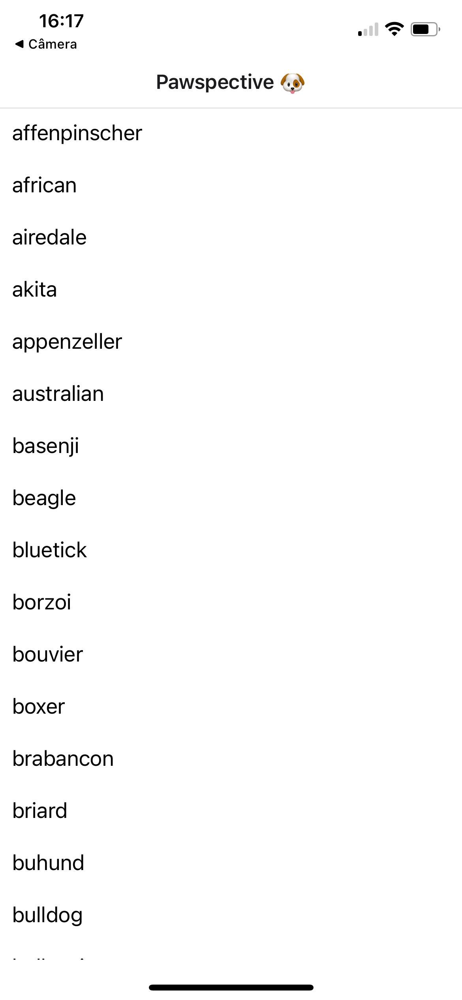

# Pawspective React Native App

In this technical challenge, you will have the opportunity to develop features in a React Native application for the Pawspective client, a social network dedicated to dog lovers. Your goal is to enhance the user experience by implementing specific features and following best practices in mobile development.

